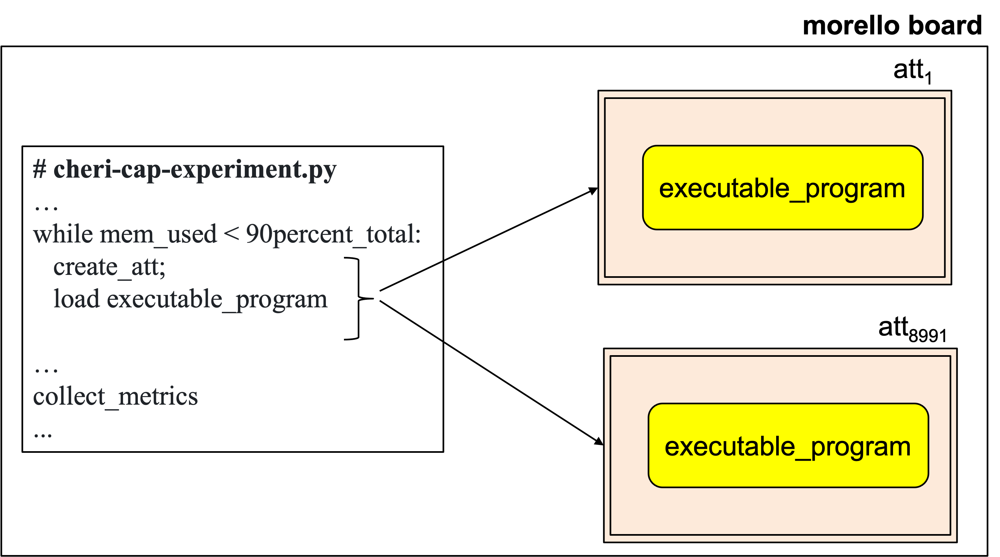

# Attestable's performance evaluation

This repository contains some experiments executed on Morello Board compartments to evaluate some of its performance parameters. Our final aim is to evaluate the cost of instantiating attestables in the Morello Board. For example, how many of them can be instantiated (created).

## Memory exhaustion by attestable replicas
The main aim of this experiment is to measure and analyse how the memory of a Morello Board is consumed by instances (also called replicas) of attestables. To this 
end, we loaded the attestsable with a C program compiled with the library compartmentalisation tool and loaded in a compartment; precisely, we used 
the enterprise application integration 
(see yellow box) use case implemented in - [tee-compartimentalisation-study-case repository](https://github.com/CAMB-DSbD/tee-compartimentalisation-study-case "Git repository").
  

The metric to measure is the number of attestables
that can be created on a Morello Board before consuming 90% of its
memory. 

In addition to the number of attestables, we took the opportunity to collect metrics about the time it takes the operating sustem to wipe the memory used by the
attestable.

Some experimental facts:

1) The morello board used to conduct the experiment
   has 17118408704 bytes  (approximately 17118.4 MB). Thus
   90% of its memory is 15406567833.6 bytes (approximately 15406.5 MB).
   
1) In the experiments that we conducted, we loaded code of the EAI
implemented in (see yellow box)- [tee-compartimentalisation-study-case repository](https://github.com/CAMB-DSbD/tee-compartimentalisation-study-case "Git repository"). We compiled as shown below:

    

  $ clang-morello -march=morello+c64 -mabi=purecap      
  -g -o integration_process  integration_process.c -L.      -Wl,-dynamic-linker,/libexec/ld-elf-c18n.so.1 
  -lssl -lcrypto -lpthread     

1) cheri-cap-experiment.py scrypt is used create the replicas of the attestables, and collect metrics. We incremented the number of replicas created 
from 1 to N.
See [replication of attestable results](https://github.com/CAMB-DSbD/tee-morello-performance-experiments/blob/main/cheri-caps-executable-performance/cheri-cap-experiment-results.csv "svs file")

 

The following figure shows the experiment set up.

  

 
</pr>

Imagine that user Alice is conducting the experiment. To created
the attestables and collect the metrics, Alice
executes the following steps:

1) Initiation: In the morello board Alice initiates cheri-cap-experiment.py.
 

1) Launch: to launch cheri-cap-experiment.py Alice executes
   % python3 cheri-cap-experiment.py

1) python3 cheri-cap-experiment.py runs incrementally creating attestable 
replicas until it detects that the attestables have 
consumed 90% of the 17118.4 MB of the Morello Board's memory, 
that is, about 15406.5 MB.

### Preliminary observations: 
The results are shown in [replication of attestable results](https://github.com/CAMB-DSbD/tee-morello-performance-experiments/blob/main/cheri-caps-executable-performance/cheri-cap-experiment-results.csv "svs file")
and exhibit an unexpected behaviour.
We expected memory consumption to increase steadily 
form 1628.3 MB which correspond to a single 
attestable replica to 15406.5 MB (90% of total memory) consumed
by N attestable replicas. The aim was to determine the
value of N.     

However, unexpectedly, memory consumption increased
steadly only up to the creation of 3800 attestable replicas
that consumed 14582.5 MB. Beyond that, intriguingly, memory
consumption decreases as the number of attestable
replicas increases. Observe that the last
metric shows that 8991 attestable replicas
consume 13066.4 MB (aproximately 76% of the total
memory).      

We do not have an explanation for that yet.
We need to double check measurements. We are
showing this preliminary results only to show
that this is a pending question in our agenda.
The analysys of the time to wipe the memory
of the attestable replicas is also pending. 

The cpu-performance and memory-performance folders
contain code and results of some experiments in 
progress. Cpu-performance is meant to measure
the performance of code running inside attestables 	
in the computation of some mathematical operations, integer 
arithmetic, floating point arithmetic, and array 
manipulation. Memory-performance is meant to
assess the time it takes an attestable to allocate
and free blocks of memory of diffetent sizes.

	
 
 
 
 ### Acknowledgements
 The code was mainly implemented mainly by 
 [Regis Rodolfo Schuch](http://gca.unijui.edu.br/student/?member=81 "Web page")      
 (regis.schuch@unijui.edu.br)  
 
 Member of the Applied Computing Research Group, Unijui University, Brazil
[Applied Computing Research Group, Unijui University, Brazil](http://gca.unijui.edu.br "Web page").

 ## Corresponding author  
 Carlos Molina-Jimenez (carlos.molina@cl.cam.ac.uk)   
 Computer Lab, University of Cambridge.
[CAMB project](https://www.cl.cam.ac.uk/research/srg/projects/camb/ "Web page").
 
